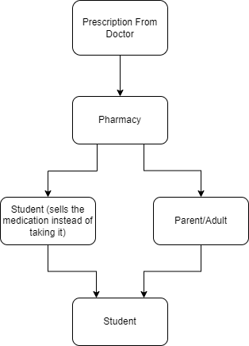

# Adderall
Adderall is a pharmaceutical that is prescribed to ADHD. It has a high tendency to be abused by students who develop a dependency on it.

# Forms
* Prescription Pills

# Supply Chain

# Steps parents could take
If your child is prescribed Adderall, ensure your child is taking it. If your child is NOT prescribed adderall, ensure your child knows the risks. Ensure your child isn't destructively focused on studies, as those students mostly turn to adderall.
