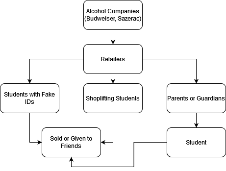

# Alcohol

Alcohol is a non-addictive drug. It is normally drunk casually, or until drunk - normally in large groups.

Contrary to popular belief, "spiking the punch bowl" is risky and expensive. It isn't hard to avoid drinking unintentionally in high school.

## Forms

* Drinks (most common)

## Supply Chain

## Steps Parents can Take

If your child wants to drink alcohol, you virtually cannot stop them -- however, you *can* educate them on safe drinking habits, making sure that they don't do anything stupid under the influence.

If you have an alcohol pantry, make sure your child can't access it when you are out of the house.

Make sure your child does not shoplift alcohol.
