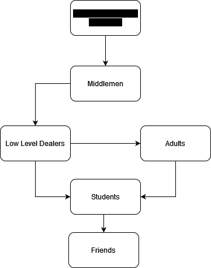

# LSD

LSD, or acid, is a non addictive drug. Though chemically it is not addictive, there is a chance of getting addicted to the hallucogenic feeling of a high.

## Forms

* Blotting paper, in squares - a paper that is divided into colorful squares, each square representing a dose
* Miro dots - tablets
* Laced sugar cubes

## Supply chain

## Steps Parents can Take

Ensure your child doesn't take drugs in general - a student with prior experience to drug abuse is more likely to take LSD.

Ensure your child knows the side effects of LSD.
