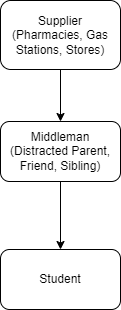

# Nicotine

Nicotine is a highly addictive drug. Normally, high schoolers try to stay away from it; high schoolers with experience with nicotine don't recommend it.

## Forms

From most to least common:
* E-cigarettes (most common around middle schoolers) - vapes, juuls with flavoring
* Zyns - nicotine chews that don't contain tobacco
* Cigarettes

## Supply Chain

## Steps Parents Can Take

Talk to your child about the dangers of exposure to nicotine. Prepare your child for peer pressure. If someone in your household smokes, ensure that they leave the nicotine where your child cannot easily steal it.
