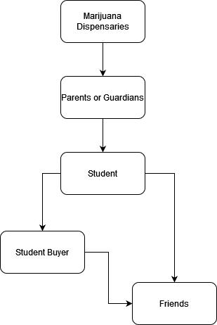

# Marijuana (weed)

Marijuana, cannabis, or weed, is a lowly-addictive drug. It is normally smoked.

## Forms

* Cigars (blunts) - the most common form
* Edibles - sweets or baked goods that have THC and CBD in them
* Other forms exist, but are normally not a major concern

## Supply Chain

## Steps Parents can Take

Make sure your child knows the risks of taking CBD. If you suspect your child is taking weed, make sure it is clear that this drug use will not be tolerated.

If you suspect your child's friend is involved, contact their parents.
